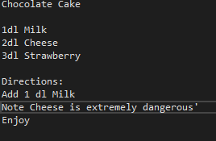

# Recipe Compiler

## This Project is under development

## Table of Contents

* [About the Project](#about-the-project)
* [Language Syntax](#language-syntax)
  * [Recipe Name](#recipe-name)
  * [Variables](#variables)
  * [Functions](#functions)
  * [Print](#print)
  * [Arithmetic](#arithmetic)
  * [IfnGo](#ifngo)
* [Getting Started](#getting-started)
  * [Prerequisites](#prerequisites)
  * [Installation](#installation)
* [Contact](#contact)

## About the project

A recipe compiler written in C++.

The compiler takes a .recipe file, a file written in a recipe programming language and compiles it into an assembly file.

## Language Syntax



### Recipe Name

The language starts with a headline, what you are baking. For example
```sh
Chocolate Cake 
```

### Variables

The variable declaration is declared after the headline. All of the variables are global and is declared as "name" and then type. The following types exists:
- 1dl (A number)
- 2dl (A character) Not implementated yet
- 3dl (A string) Not implementated yet
- 4dl (A bool) Not implementated yet
```sh
1dl Milk
```

### Functions

The main function is always declared as "Directions:" other functions just has a name with a ":" on the end.
```sh
Function:
```

### Print

The print only prints variables, but you can write whatever text you like here. The print starts with "Note" and ends with "'"\
For example with the Milk as a variable
```sh
Note that the milk can warm up very fast'
```

### Arithmetic

To add two variables together you write. Add (giver Variable or constant) (Free word) (Recieving Variable)\
For example
```sh
Add 1 dl Milk'
```
This is equal to
```sh
Milk = Milk + 1;
```
Subtract (Not added yet)
Multiplication (Not added yet)
Division (Not added yet)

### IfnGo

Not implemented yet

## End of the program

The program is ended with the "Enjoy"

## Getting started

### Prerequisites

* Visual Studio [https://visualstudio.microsoft.com/downloads/](https://visualstudio.microsoft.com/downloads/)
Visual Studio is optional, but the project does not contain any Makefiles so if you dont use it you have to write them yourself.

* GCC compiler [https://sourceforge.net/projects/mingw-w64/](https://sourceforge.net/projects/mingw-w64/)

* NASM compiler [https://www.nasm.us/](https://www.nasm.us/)

Note: The project only works on windows. Be sure to set the environment variable for NASM and GCC

### Installation

1. Clone the repository
2. Open recipecomp.sln in Visual Studio
3. Select the .recipe file in Visual Studio
- Right click on the project -> Properties -> Debugging -> Commandline arguments
4. Run the project
5. Type "nasm -f win32 outputFile.asm"
6. Type "gcc -m32 outputFile.obj -o outputFile.exe"
7. Type "outputFile"

## Contact

Tobias Mellberg - Tobbemellberg@hotmail.se
